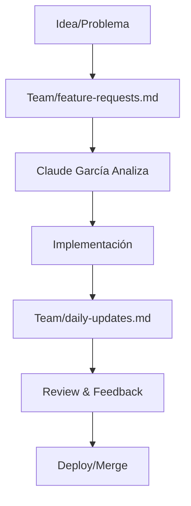

# 📋 **TEAM COMMUNICATION - PLANIFICAPRO**

## 🏢 **Estructura del Equipo**

### 👥 **Miembros Actuales:**
- **🤖 Claude Garcia** - Full-Stack Developer & Tech Lead
- **👤 [Tu Nombre]** - Project Owner & Product Manager
- **📝 [Otros miembros]** - [Roles pendientes de definir]

---

## 📱 **Canales de Comunicación**

### 📂 **Esta Carpeta `/Team/`**
**Propósito**: Comunicación asíncrona, documentación de decisiones, reportes de progreso

**Estructura de Archivos:**
- `claude-garcia-profile.md` - Perfil del desarrollador
- `daily-updates.md` - Updates diarios
- `project-decisions.md` - Decisiones técnicas importantes
- `bug-reports.md` - Reportes de errores
- `feature-requests.md` - Solicitudes de funcionalidades
- `meeting-notes.md` - Notas de reuniones

---

## 🎯 **Metodología de Trabajo**

### 📅 **Ciclo de Desarrollo:**
```
1. 📋 Planning (Lunes)
   └── Definir objetivos semanales
   
2. 💻 Development (Martes-Jueves)
   └── Implementación y testing
   
3. 🧪 Testing & Review (Viernes)
   └── QA y preparación para siguiente sprint
   
4. 📊 Demo & Feedback (Viernes tarde)
   └── Presentación de avances
```

### 🔄 **Flujo de Comunicación:**


---

## 📝 **Plantillas de Comunicación**

### 🚀 **Para Nuevas Funcionalidades:**
```markdown
## ✨ Nueva Funcionalidad: [NOMBRE]

**📅 Fecha**: YYYY-MM-DD
**👤 Solicitado por**: [Nombre]
**🎯 Prioridad**: Alta/Media/Baja

### 📋 Descripción:
[Descripción detallada]

### 🎯 Objetivos:
- [ ] Objetivo 1
- [ ] Objetivo 2

### 🛠️ Requerimientos Técnicos:
- Backend: [Especificaciones]
- Frontend: [Especificaciones]
- Database: [Cambios necesarios]

### 📊 Criterios de Aceptación:
- [ ] Criterio 1
- [ ] Criterio 2

**🤖 Asignado a**: Claude Garcia
**⏰ Estimación**: [X días/horas]
```

### 🐛 **Para Reportes de Bugs:**
```markdown
## 🐛 Bug Report: [TÍTULO]

**📅 Fecha**: YYYY-MM-DD
**👤 Reportado por**: [Nombre]
**🚨 Severidad**: Crítica/Alta/Media/Baja

### 🔍 Descripción del Problema:
[Descripción detallada]

### 📱 Cómo Reproducir:
1. Paso 1
2. Paso 2
3. Error observado

### 🖥️ Ambiente:
- Browser: [Chrome/Firefox/etc]
- Dispositivo: [Desktop/Mobile]
- URL: [Donde ocurre]

### 📷 Screenshots/Videos:
[Si aplica]

**🤖 Asignado a**: Claude Garcia
**⏰ Estado**: Nuevo/En Proceso/Resuelto
```

### 📊 **Para Updates Diarios:**
```markdown
## 📅 Daily Update - [FECHA]

### ✅ Completado Hoy:
- [Item 1]
- [Item 2]

### 🚧 En Progreso:
- [Item 1] - [% completado]
- [Item 2] - [Bloqueadores si los hay]

### 📅 Plan para Mañana:
- [Item 1]
- [Item 2]

### 🚨 Bloqueadores/Issues:
- [Ninguno / Descripción]

### 💡 Notas Adicionales:
[Observaciones, ideas, etc.]

---
*Claude Garcia - [Fecha]*
```

---

## 🎯 **Protocolos de Trabajo**

### ⚡ **Respuesta a Solicitudes:**
- **🟢 Funcionalidades Simples**: 24 horas
- **🟡 Funcionalidades Complejas**: 48-72 horas  
- **🔴 Bugs Críticos**: 2-4 horas
- **🟠 Bugs Normales**: 24 horas

### 📋 **Documentación Requerida:**
- Cada nueva funcionalidad debe estar documentada
- Cambios en BD deben ser reportados
- Testing results deben ser compartidos
- Screenshots de UI changes son requeridos

### 🔄 **Review Process:**
1. **Desarrollo** → Claude Garcia implementa
2. **Testing** → Claude Garcia testea funcionalmente
3. **Demo** → Se presenta la funcionalidad
4. **Feedback** → Se reciben comentarios
5. **Refinamiento** → Se hacen ajustes si es necesario
6. **Deployment** → Se integra al sistema principal

---

## 🚀 **Objetivos del Equipo - Septiembre 2025**

### 🎯 **Semana 1 (Sep 9-13):**
- [x] ✅ Setup completo del proyecto
- [x] ✅ API Service implementado
- [x] ✅ Sistema de autenticación
- [ ] 🔄 Módulo de Ingresos completo
- [ ] 🔄 Módulo de Gastos completo

### 🎯 **Semana 2 (Sep 16-20):**
- [ ] 📋 Módulo de Créditos
- [ ] 📋 Sistema de Reportes básico
- [ ] 📋 Dashboard con gráficos

### 🎯 **Semana 3 (Sep 23-27):**
- [ ] 📋 Módulo Tributario
- [ ] 📋 Sistema de Sugerencias
- [ ] 📋 Optimizaciones de performance

### 🎯 **Semana 4 (Sep 30 - Oct 4):**
- [ ] 📋 Testing completo
- [ ] 📋 Deploy production
- [ ] 📋 Documentación final

---

## 💬 **Mensajes Rápidos**

### 🤖 **Claude Garcia Dice:**
> "¡Team! Estoy listo para hacer de PLANIFICAPRO el mejor sistema financiero. Mantengamos comunicación fluida y construyamos algo increíble juntos. 💪"

### 📝 **Próximas Comunicaciones:**
- Daily updates serán posteados aquí cada día
- Decisiones importantes se documentarán
- Todo el progreso será transparente

---

**🚀 ¡Empezamos con el pie derecho! Let's build something amazing!**

---
*Team Communication Hub - PLANIFICAPRO 2025*
